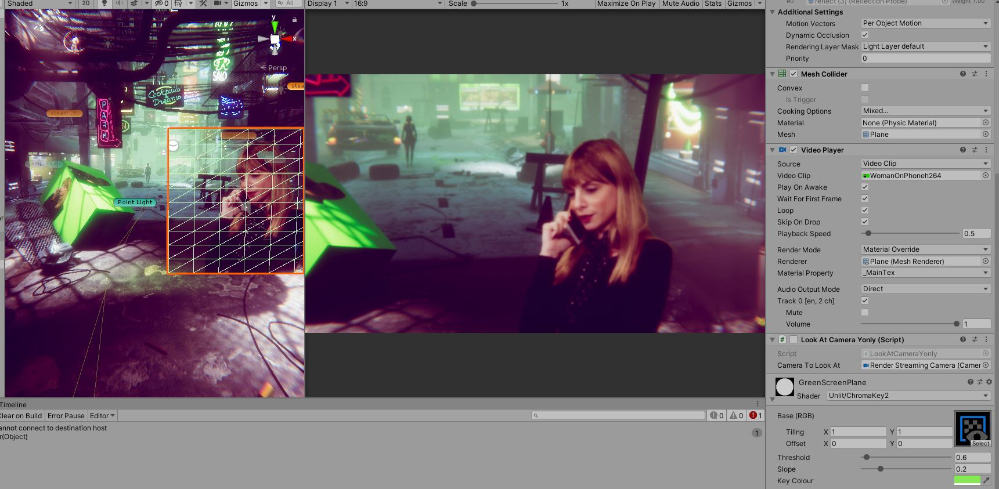

# HDRP-Unity-Chromakey
A simple Chromakeyer for the HDRP for Unity for Cinematic Virtual Production. 

### Simple ChromaKeyer for HDRP
This is a first attempt at Shader graph, considering there were no ready available chromakey solutions on Unity Asset store that work (as of May 2020) with the HDRP pipeline.
Users are encouraged to develop or optimize this further - especially nice would be additional colors to key out, and more sliders to control spill, smoothing etc.
